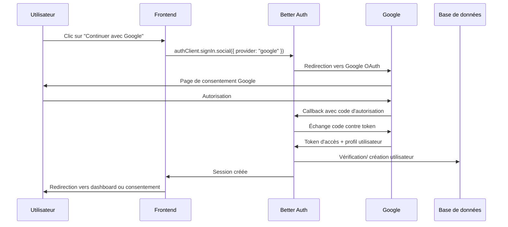
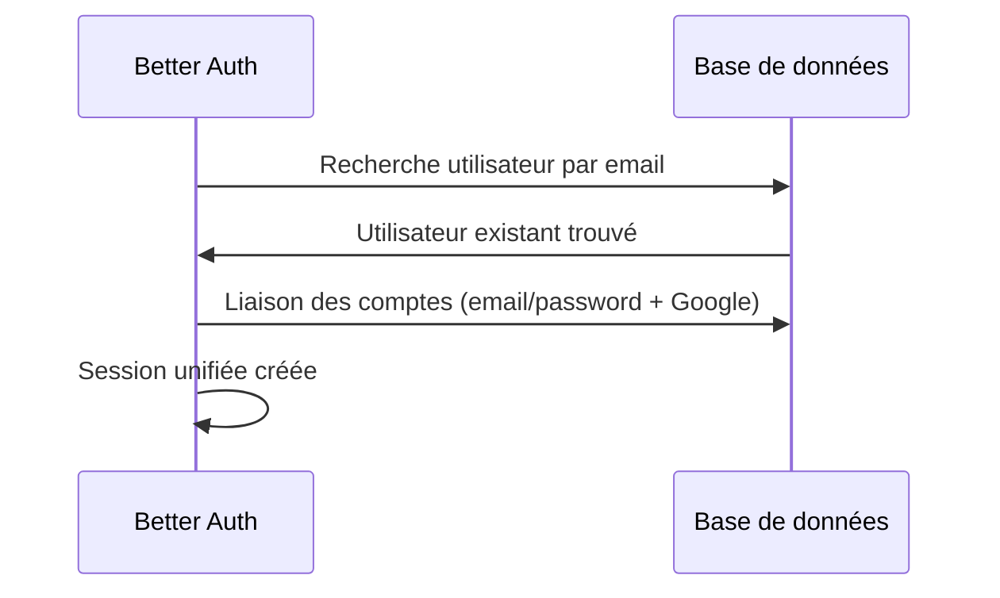
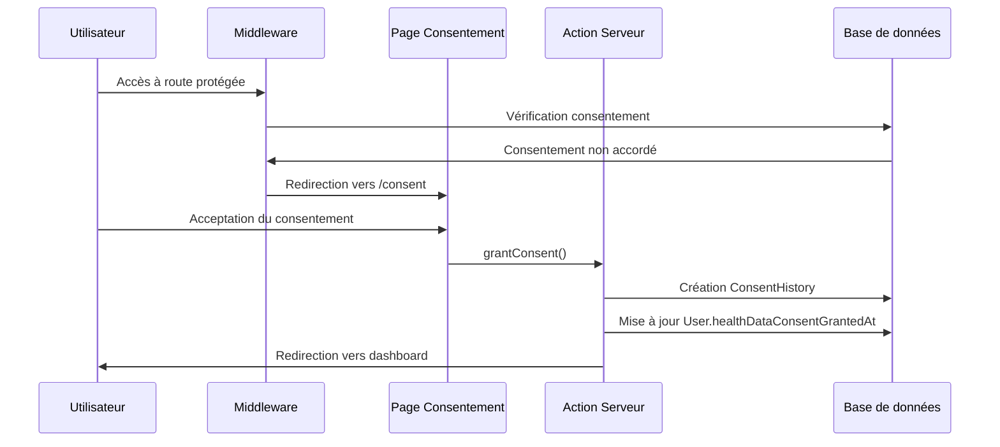

# Documentation Google Auth - Health In Cloud

## Vue d'ensemble

Cette documentation décrit l'implémentation de l'authentification Google dans Health In Cloud, permettant aux utilisateurs de se connecter avec leur compte Google tout en respectant les exigences de consentement pour les données de santé.

## Architecture

### Composants principaux

1. **Backend (Better Auth)**
   - Configuration Google OAuth dans `lib/auth.ts`
   - Account linking automatique
   - Gestion des sessions avec consentement

2. **Frontend (React/Next.js)**
   - Composant `GoogleButton` réutilisable
   - Intégration dans les formulaires de connexion/inscription
   - Page de consentement dédiée

3. **Middleware de protection**
   - Vérification du consentement pour les routes protégées
   - Redirection automatique vers la page de consentement

4. **Base de données**
   - Champ `healthDataConsentGrantedAt` sur le modèle User
   - Table `ConsentHistory` pour l'audit

## Configuration

### Variables d'environnement

```bash
# Google OAuth
GOOGLE_CLIENT_ID=your_google_client_id
GOOGLE_CLIENT_SECRET=your_google_client_secret
```

### Configuration Google Cloud Console

1. **Créer un projet Google Cloud**
2. **Activer l'API Google OAuth**
3. **Configurer l'écran de consentement OAuth**
4. **Créer les credentials OAuth** avec les URLs suivantes :

**Authorized JavaScript origins :**
```
http://localhost:3000
https://healthincloud.app
https://www.healthincloud.app
https://app.healthincloud.app
```

**Authorized redirect URIs :**
```
http://localhost:3000/api/auth/callback/google
https://healthincloud.app/api/auth/callback/google
https://www.healthincloud.app/api/auth/callback/google
https://app.healthincloud.app/api/auth/callback/google
```

## Flux d'authentification

### 1. Connexion Google



### 2. Account Linking

Si un utilisateur existe déjà avec le même email :



### 3. Gestion du consentement



## Implémentation technique

### Backend - Configuration Better Auth

```typescript
// lib/auth.ts
export const auth = betterAuth({
  socialProviders: {
    google: {
      clientId: process.env.GOOGLE_CLIENT_ID!,
      clientSecret: process.env.GOOGLE_CLIENT_SECRET!,
      redirectURI: `${baseURL}/api/auth/callback/google`,
    },
  },
  accountLinking: {
    enabled: true,
    trustedProviders: ["google"],
  },
  // ... autres configurations
});
```

### Frontend - Composant GoogleButton

```typescript
// components/auth/google-button.tsx
export function GoogleButton({ className }: GoogleButtonProps) {
  const handleGoogleSignIn = async () => {
    await authClient.signIn.social({
      provider: "google",
    });
  };

  return (
    <Button variant="outline" onClick={handleGoogleSignIn}>
      <FcGoogle className="mr-2 h-5 w-5" />
      {t("auth.continueWithGoogle")}
    </Button>
  );
}
```

### Middleware - Vérification du consentement

```typescript
// middleware.ts
if (session?.user) {
  const { PrismaClient } = await import("@prisma/client");
  const prisma = new PrismaClient();
  
  const user = await prisma.user.findUnique({
    where: { id: session.user.id },
    select: { healthDataConsentGrantedAt: true },
  });

  if (!user?.healthDataConsentGrantedAt) {
    const consentUrl = new URL(`/${locale}/consent`, request.url);
    return NextResponse.redirect(consentUrl);
  }
}
```

### Action serveur - Grant consent

```typescript
// app/actions/grant-consent.ts
export async function grantConsent() {
  const session = await auth.api.getSession({
    headers: await headers(),
  });

  if (!session?.user) {
    throw new Error("Utilisateur non authentifié");
  }

  if (session.user.healthDataConsentGrantedAt) {
    throw new Error("Consentement déjà accordé");
  }

  // Créer l'entrée dans ConsentHistory
  await prisma.consentHistory.create({
    data: {
      userId: session.user.id,
      consentType: "HEALTH_DATA",
      granted: true,
      ipAddress: headersList.get("x-forwarded-for"),
      userAgent: headersList.get("user-agent"),
    },
  });

  // Mettre à jour le champ de référence rapide
  await prisma.user.update({
    where: { id: session.user.id },
    data: { healthDataConsentGrantedAt: new Date() },
  });

  return { success: true };
}
```

## Base de données

### Modèle User

```prisma
model User {
  id                          String    @id @default(cuid())
  email                       String    @unique
  name                        String?
  emailVerified               DateTime?
  healthDataConsentGrantedAt  DateTime? // Nouveau champ pour le consentement
  createdAt                   DateTime  @default(now())
  updatedAt                   DateTime  @updatedAt
  
  // Relations
  consentHistory              ConsentHistory[]
  // ... autres relations
}
```

### Modèle ConsentHistory

```prisma
model ConsentHistory {
  id           String      @id @default(cuid())
  userId       String
  consentType  ConsentType
  granted      Boolean
  grantedAt    DateTime    @default(now())
  ipAddress    String?
  userAgent    String?

  user User @relation(fields: [userId], references: [id], onDelete: Cascade)
}

enum ConsentType {
  HEALTH_DATA
}
```

## Sécurité

### Mesures de sécurité implémentées

1. **Validation des tokens Google**
   - Vérification des tokens d'autorisation
   - Validation des domaines autorisés

2. **Protection des données de santé**
   - Consentement explicite requis
   - Audit trail complet
   - Chiffrement des données sensibles

3. **Gestion des sessions**
   - Cookies sécurisés
   - Expiration automatique
   - Protection CSRF

4. **Account linking sécurisé**
   - Vérification de l'email
   - Liaison automatique uniquement pour les providers de confiance

### Bonnes pratiques

- **Ne jamais exposer les secrets** dans le code client
- **Valider tous les inputs** côté serveur
- **Logger les actions sensibles** pour l'audit
- **Implémenter la rotation des secrets** régulièrement

## Tests

### Tests unitaires

```typescript
// __tests__/components/auth/google-button.test.tsx
describe("GoogleButton", () => {
  it("should call authClient.signIn.social with 'google' when clicked", () => {
    render(<GoogleButton />);
    const button = screen.getByRole("button", { name: /continue with google/i });
    fireEvent.click(button);
    expect(authClient.signIn.social).toHaveBeenCalledWith({ provider: "google" });
  });
});
```

### Tests E2E

```typescript
// e2e/auth.spec.ts
test.describe("Google Auth", () => {
  test("should show Google button on login page", async ({ page }) => {
    await page.goto("/fr/auth/login");
    const googleButton = page.getByRole("button", { name: /continuer avec google/i });
    await expect(googleButton).toBeVisible();
  });
});
```

## Déploiement

### Étapes de déploiement

1. **Configuration des variables d'environnement**
   ```bash
   GOOGLE_CLIENT_ID=production_client_id
   GOOGLE_CLIENT_SECRET=production_client_secret
   ```

2. **Mise à jour des URLs dans Google Cloud Console**
   - Ajouter les domaines de production
   - Configurer les redirect URIs

3. **Migration de la base de données**
   ```bash
   npm run db:deploy
   ```

4. **Tests de validation**
   - Test du flux complet Google Auth
   - Vérification du consentement
   - Test des redirections

### Monitoring

- **Logs d'authentification** : Surveiller les tentatives de connexion
- **Erreurs de consentement** : Tracker les échecs de consentement
- **Performance** : Monitorer les temps de réponse OAuth

## Dépannage

### Problèmes courants

1. **"redirect_uri_mismatch"**
   - Vérifier que l'URL de callback est exactement celle configurée
   - Respecter HTTP vs HTTPS

2. **"invalid_client"**
   - Vérifier le Client ID et le Client Secret
   - S'assurer que l'API OAuth est activée

3. **"Consentement déjà accordé"**
   - Vérifier l'état de la base de données
   - Utiliser le script de debug si nécessaire

4. **Hydratation React**
   - Éviter les classes CSS responsives dans les composants SSR
   - Utiliser des variables d'environnement pour les URLs

### Scripts de debug

```javascript
// debug-session.js
const { PrismaClient } = require('@prisma/client');
const prisma = new PrismaClient();

async function debugUser() {
  const users = await prisma.user.findMany({
    select: {
      id: true,
      email: true,
      healthDataConsentGrantedAt: true,
    },
  });
  
  console.log('Utilisateurs:', users);
}

debugUser();
```

## Évolutions futures

### Améliorations possibles

1. **Support multi-providers**
   - Ajout d'autres providers OAuth (Microsoft, Apple)
   - Gestion unifiée des providers

2. **Consentement granulaire**
   - Types de consentement spécifiques
   - Révocation partielle

3. **Analytics avancées**
   - Tracking des conversions
   - Métriques d'engagement

4. **Sécurité renforcée**
   - 2FA obligatoire
   - Détection d'anomalies

## Références

- [Better Auth Documentation](https://www.better-auth.com/)
- [Google OAuth 2.0 Documentation](https://developers.google.com/identity/protocols/oauth2)
- [Next.js Middleware](https://nextjs.org/docs/app/building-your-application/routing/middleware)
- [Prisma Documentation](https://www.prisma.io/docs)

---

**Dernière mise à jour :** Octobre 2025  
**Version :** 1.0.0  
**Auteur :** Équipe Health In Cloud
